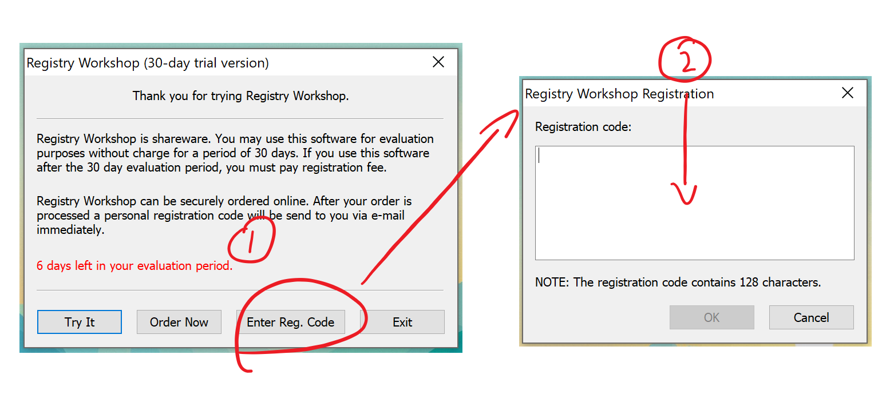

# Registry Workshop Keygen

## How to use?

```
Usage:
    RegWorkshopKeygen.py <name> [license_count]

<name>:
    The name licensed to.
    This parameter must be specified.

[license_count]:
    A integer from 1 to 500.
    This parameter is optional and default value is 1.
```

Example:

```bash
$ ./RegWorkshopKeygen.py foobar 10
082bb5c02150385e7e4f069407079583cde64af1646780a5dfa962fe33bec1082c8db98d6bf972beba2505dc15fa69dd5c59dd5fc6998f6022e6be6a92f3d2e2
```

And paste the output to



